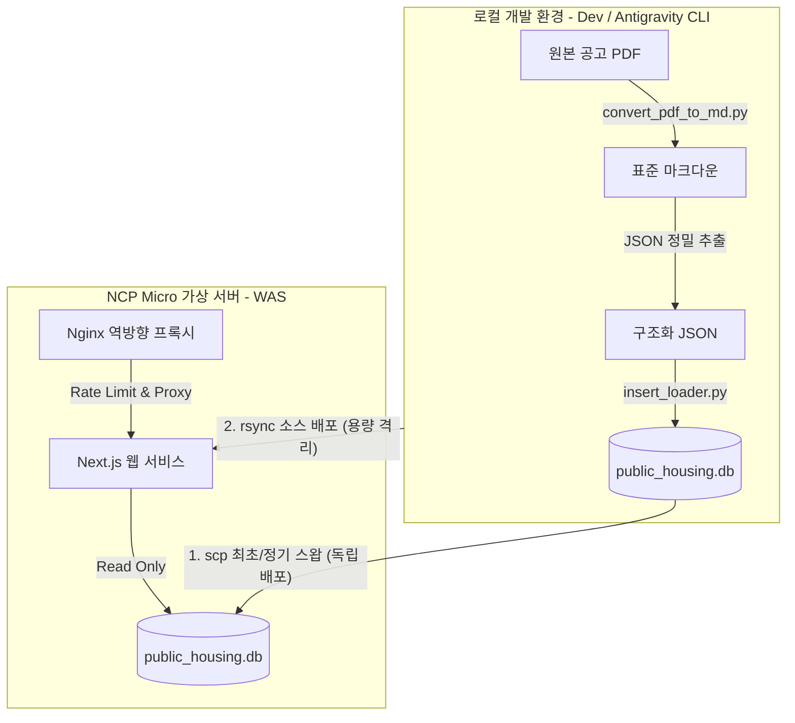

# Public Housing PDF Parser & Dashboard

공공기관(LH, SH 등)에서 발행하는 복잡한 **임대주택 입주자 모집 공고 PDF 문서**를 자동으로 분석 및 정제하여 관계형 데이터베이스(SQLite)에 적재하고, 이를 지도 기반의 **Next.js 풀스택 대시보드 웹 애플리케이션**을 통해 사용자에게 체계적이고 직관적인 정보로 시각화해 주는 통합 서비스입니다.

---

## 🚀 주요 기능 (Key Features)

1. **PDF to Markdown 자동 변환 및 표준화**
   * Java 기반 PDF 분석 엔진과 `opendataloader-pdf` 라이브러리를 활용하여 표와 텍스트 서식이 포함된 PDF 공고문을 고품질 마크다운 및 이미지 리소스로 자동 표준화합니다.
2. **정밀 전처리 및 7대 특성 감지**
   * [pre_processor.py](file:///home/iru/project03/.agents/scripts/pre_processor.py)를 통해 공고의 7대 기본 특성 플래그(분산형 공고 유무, 전세임대 여부 등)를 감지하고 복잡한 병합 표 셀들을 평탄화합니다.
3. **데이터 정합성 검증 및 이중 로깅 적재**
   * [critic_validator.py](file:///home/iru/project03/.agents/scripts/critic_validator.py)를 거쳐 수학적/논리적 무결성 및 날짜 선후 관계를 실시간 검증합니다.
   * [insert_loader.py](file:///home/iru/project03/.agents/scripts/insert_loader.py)를 통해 관계형 SQLite DB(`public_housing.db`)에 이중 로깅 적재를 완결하며, 실패 시 본문을 안전하게 격리 보관하는 '우아한 성능 저하 우회 적재' 프로토콜을 탑재하고 있습니다.
4. **Naver Maps 연동 지도 시각화**
   * 네이버 지도 API(ncpKeyId 인증 방식) 및 동적 Geocoder 연동으로 공급 단지들의 실제 위치 매핑 및 지오코딩 폴백을 지원합니다.
5. **실무형 라이트 모드 대시보드 및 상세 패널**
   * 과도한 스타일을 지양한 전문적인 라이트 모드(Light Mode)와 바닐라 CSS 전역 디자인 토큰 시스템을 엄격히 준수합니다.
   * [사이드바 | 지도] 양분형 레이아웃, 아코디언 세부조건 가이드, 클릭 시 우측에서 등장하는 공급 평형별 슬라이딩 상세 패널을 제공합니다.

---

## 📐 서비스 아키텍처 (Service Architecture)

본 서비스는 무겁고 복잡한 PDF 전처리 작업과 사용자 서빙(Serving) 레이어를 물리적으로 완전히 격리하여 설계되었습니다. 이를 통해 초경량 가상 서버(NCP Micro 1GB RAM)의 자원 낭비를 원천 방지하고 최상의 웹 반응 속도를 유지합니다.



* **로컬 영역 (Data Pipeline)**: CPU와 메모리 사용량이 극도로 높은 PDF 변환, 정제 및 적재의 전 과정을 로컬에서 전담 마크하여 완성형 SQLite DB 파일 단 한 개로 축약합니다.
* **서버 영역 (Web Serving)**: 이미 데이터 구축이 끝난 `public_housing.db` 파일의 읽기(Read-Only) 동작만 수행하며 3000포트 Next.js 및 Nginx 입구 방화벽(Rate Limit)을 통해 가볍게 화면을 서빙합니다.

---

## 🚀 경량화 배포 흐름 (Deployment Flow)

서버 성능 최적화와 실서비스 데이터의 안전한 보호를 위해 소스 코드 배포와 데이터베이스 배포가 정밀하게 분리(격리)되어 수행됩니다.

1. **소스 코드 배포 (rsync)**: 
   * 로컬의 무거운 PDF 원본(`.pdf`, `.md`), 파이썬 가상환경(`venv/`), Git 히스토리 및 개발 문서들 외에 실서비스용 데이터베이스(`public_housing.db*`)와 마스터 키 파일(`.pem`), 환경변수(`.env.local`)까지 완벽히 전송 제외(`--exclude`)하여 소스 코드만 초고속으로 동기화합니다.
2. **중요 설정 및 데이터 업로드 (scp)**: 
   * 네이버 API 환경변수 파일(`.env.local`)과 최신 데이터베이스 파일(`public_housing.db`)은 최초 1회 또는 데이터 갱신 시에만 `scp` 명령어로 타깃 지정하여 개별 단독 업로드합니다.
3. **무중단 운영 스왑 (Zero-Downtime Swap)**:
   * 공고 데이터가 갱신되어 DB 파일을 교체할 때, 웹서버를 다운시키지 않고 `scp`로 최신 DB를 제자리에 스왑한 뒤 `pm2 reload` 명령어만 입력하여 무중단 상태로 즉각 최신 데이터를 클라이언트에게 서비스합니다.

---

## 🛠️ 개발 환경 및 요구사항 (Prerequisites)

* **Python:** 3.10 이상 (프로젝트 루트의 가상 환경 `venv` 연동 필수)
* **Java:** JDK 11 이상 (PDF 분석 엔진 구동용)
* **Node.js:** v24.16.0 이상 (npm 11.13.0)
* **Database:** SQLite 3

---

## 📂 폴더 구조 요약 (Directory Structure)

```text
project03/
├── .agents/
│   ├── scripts/
│   │   ├── convert_pdf_to_md.py    # PDF to Markdown 자동 변환 스크립트
│   │   ├── pre_processor.py        # 0단계: 7대 기본 특성 및 테이블 평탄화 전처리
│   │   ├── critic_validator.py     # 2단계: 수학적/논리적 데이터 정합성 검증기
│   │   ├── insert_loader.py        # 3단계: SQLite DB 데이터 적재 및 실패 격리 로그
│   │   └── audit_db.py             # DB 적재 후 정합성 사후 감사 및 누락 감출
│   └── commit_convention.md        # Conventional Commits 규칙 정의 가이드
├── docs/
│   ├── pdf/                        # 원본 PDF 저장소 (규격 폴더 구조)
│   ├── md/                         # 변환된 마크다운 문서 및 정제 JSON(data.json) 물리 보관소
│   └── dev/
│       └── DEPLOYMENT.md           # NCP Micro 서버 전용 상세 배포 및 트러블슈팅 가이드
├── src/
│   ├── app/                        # Next.js App Router (대시보드 페이지 및 REST API)
│   ├── components/                 # 네이버 지도(Map.tsx), 사이드바, 슬라이딩 상세 패널
│   └── lib/                        # SQLite 데이터베이스 커넥터 모듈 (db.ts)
├── public_housing.db               # 최종 적재 완료된 SQLite 데이터베이스
├── package.json                    # Node.js 패키지 및 스크립트 정의
└── tsconfig.json                   # TypeScript 설정 파일
```

---

## 💻 실행 및 사용 방법 (Execution Guide)

### 1. 가상 환경 설정 및 패키지 설치
```bash
# 가상 환경 생성 및 활성화
python3 -m venv venv
source venv/bin/activate

# 필수 파이썬 패키지 설치
pip install opendataloader-pdf
```

### 2. PDF 변환 및 데이터 적재 파이프라인 기동

* **PDF에서 마크다운 및 이미지 변환**
  ```bash
  # 미분류 PDF 파일 자동 스캔 및 변환 일괄 실행
  ./venv/bin/python .agents/scripts/convert_pdf_to_md.py
  
  # 특정 공고 폴더 단일 변환 (권장)
  ./venv/bin/python .agents/scripts/convert_pdf_to_md.py <공고_폴더명>
  ```

* **데이터 적재 및 강제 실패 격리 실행**
  ```bash
  # 밸리데이터 검증을 통과한 JSON 정제 데이터를 DB에 최종 적재
  ./venv/bin/python .agents/scripts/insert_loader.py docs/md/{공고_폴더}/data.json docs/md/{공고_폴더}/data.json
  
  # 정합성 검증 실패 시 원본 마크다운을 격리 보존하는 우아한 성능 저하 우회 적재
  ./venv/bin/python .agents/scripts/insert_loader.py --status FAIL --doc_path docs/md/{공고_폴더}/document.md --error_message "검증 에러 내용"
  ```

* **데이터베이스 적재 이력 및 정합성 감사**
  ```bash
  # 물리 폴더 대조 및 참조 무결성, 누락 공고 검출 감사 리포트 출력
  ./venv/bin/python .agents/scripts/audit_db.py
  ```

### 3. Next.js 대시보드 웹 개발 서버 실행
```bash
# Node 종속성 복원
npm install

# 로컬 개발 서버 가동
npm run dev
```
브라우저에서 [http://localhost:3000](http://localhost:3000)으로 접속하여 지도 및 실시간 아코디언 필터링 대시보드를 확인할 수 있습니다.

---

## 📄 형상 관리 및 개발 규약

* **Git 커밋 규칙**: 모든 커밋은 Conventional Commits에 기재된 형태를 따르며, 구체적인 작성 규약은 [.agents/commit_convention.md](file:///home/iru/project03/.agents/commit_convention.md)를 참조하십시오.
* **디자인 토큰 시스템**: 모든 UI 간격 및 색상은 컴포넌트 내에 하드코딩하지 않고 전역 [globals.css](file:///home/iru/project03/src/app/globals.css)의 디자인 토큰 변수에 100% 종속됩니다.
* **에이전트 소통 규약**: AI 에이전트의 행동 및 피드백 누적 규칙에 대한 규정은 [AGENTS.md](file:///home/iru/project03/AGENTS.md) 파일에 명기되어 있습니다.
