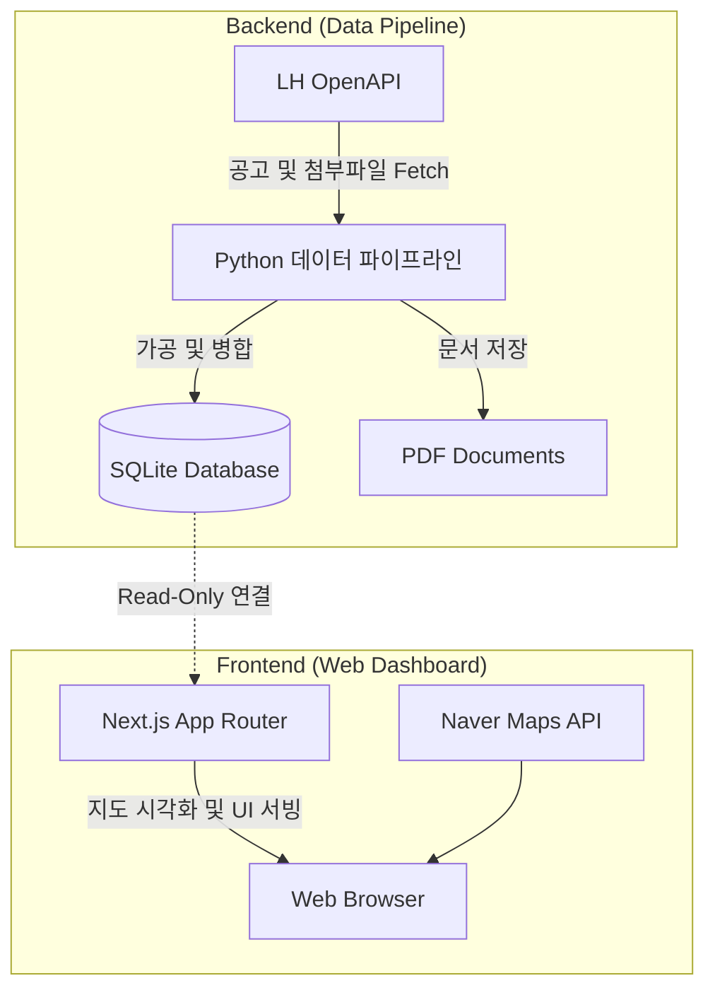

# PleaseHome (플리즈홈) - 통합 임대주택 정보 대시보드 🏠

> 🌐 **실제 서비스 URL**: [https://pleasehome.com](https://pleasehome.com)

[](https://www.typescriptlang.org/)
[](https://www.python.org/)
[](https://nextjs.org/)
[](https://www.ncloud.com/)
[](https://sqlite.org/)
[](https://opensource.org/licenses/MIT)

**PleaseHome(플리즈홈)**은 LH, SH, GH 등 공공기관에서 발행하는 방대하고 복잡한 임대주택 입주자 모집 공고를 정밀 분석하여, 사용자 친화적인 지도 기반 인터페이스로 제공하는 풀스택 서비스입니다. 

기존에 분리되어 운영되던 프론트엔드(Next.js 대시보드)와 백엔드(Python 데이터 파이프라인)를 하나의 모노레포(Monorepo)로 통합하여 유지보수성 및 개발 생산성을 극대화하였습니다.

---

## 🚀 핵심 기능 (Key Features)

### 1. 데이터 파이프라인 (Backend)
* **공공데이터포털(OpenAPI) 연동**: LH 분양임대공고문 API와 실시간 통신하여 최신 입주자 모집 공고 목록과 세부 상세 정보(BBS)를 자동 수집합니다.
* **자동화된 문서 수집**: 공고문에 첨부된 필수 PDF 원문(모집 안내문 등)을 식별하여 지정된 로컬/클라우드 스토리지로 일괄 다운로드하는 ETL 파이프라인을 갖추고 있습니다.

### 2. 지도 기반 대시보드 (Frontend)
* **실시간 지리 시각화**: 네이버 지도 API와 연동하여 위경도 좌표를 기반으로 공공주택 단지를 브라우저 레이턴시 없이 즉시 렌더링합니다.
* **다차원 조건별 맞춤 필터링**: 공고 기관별, 임대 유형별, 공급 대상별 및 보증금/월세 범위 등 사용자 맞춤형 조건을 통한 빠른 필터링을 지원합니다.
* **상세 조건 대조 분석**: 단지 선택 시 우측 슬라이딩 상세 패널을 통해 평형, 공급 호수, 기본 임대조건 및 최대 전환 조건(보증금 ↔ 월세)을 직관적으로 대조합니다.

---

## 📐 시스템 아키텍처 (Architecture)

웹 서비스 운영의 효율성과 시스템 자원의 최적화를 위해 **데이터 적재(Backend)**와 **웹 서빙(Frontend)**의 책임을 명확하게 분리합니다.



> **아키텍처 설계 철학**: 
> 초경량 가상 서버(NCP Micro 등)에서의 안정적인 무중단 서비스를 위해, 무거운 API 통신 및 데이터 가공 작업은 백엔드 파이프라인에서 선제적으로 처리하여 완성된 SQLite `.db` 파일 형태로 빌드합니다. 프론트엔드는 오직 이 완성된 DB 파일을 `Read-Only`로 조회하며 빠른 화면 서빙에만 집중합니다.

---

## 📂 프로젝트 구조 (Project Structure)

```text
pleasehome/
├── frontend/                   # 웹 프론트엔드 (Next.js 14+)
│   ├── src/app/                # App Router 기반 페이지 & REST API
│   ├── src/components/         # 지도, 사이드바 등 재사용 UI 컴포넌트
│   ├── public/                 # 정적 에셋 파일
│   └── package.json            # Node.js 의존성 관리
├── backend/                    # 데이터 파이프라인 백엔드 (Python)
│   └── src/lh_notice/          # LH API 연동 및 PDF 다운로드 스크립트
├── docs/                       # 각종 설계 및 배포 가이드 문서
├── .gitignore                  # 통합 형상 관리 예외 규칙
└── README.md                   # 프로젝트 메인 문서 (Current)
```

---

## 🛠️ 개발 환경 구축 및 실행 가이드 (Getting Started)

### 1. 사전 요구사항 (Prerequisites)
* **Node.js**: v24.16.0 이상 (npm v11.13.0+)
* **Python**: v3.10 이상
* **Database**: SQLite 3

### 2. 환경 변수 설정
최상위 루트(또는 각 폴더 루트)에 `.env.local` 파일을 생성하고 아래의 API Key를 설정합니다.
```env
# Frontend (Naver Map API)
NEXT_PUBLIC_NAVER_CLIENT_ID=your_naver_map_client_id

# Backend (LH OpenAPI - 공공데이터포털)
LH_NOTICE_LIST_API_KEY=your_lh_list_decoded_api_key
LH_NOTICE_DTL_API_KEY=your_lh_detail_decoded_api_key
```

### 3. 백엔드 파이프라인 실행 (데이터 수집)
```bash
# 패키지 설치
pip install requests python-dotenv

# LH API 통신 및 PDF 다운로드 스크립트 실행
cd backend/src/lh_notice
python main.py
```

### 4. 프론트엔드 대시보드 실행 (웹 서비스)
```bash
# Node 패키지 설치
cd frontend
npm install

# 로컬 웹 개발 서버 가동
npm run dev
```
서버 가동 후 브라우저를 통해 [http://localhost:3000](http://localhost:3000) 에 접속하시면 지도 대시보드 화면을 확인하실 수 있습니다.

---

## 🚀 CI/CD 및 배포 파이프라인 (Deployment Pipeline)

본 프로젝트는 최소한의 클라우드 서버 자원(Micro 단위)을 효율적으로 활용하기 위해 격리된 무중단 배포(Zero-Downtime) 전략을 취하고 있습니다.

1. **로컬 빌드 및 데이터 적재**:
   * 로컬 환경에서 외부 API 통신을 통해 최신 `public_housing.db` 구축 및 검증.
   * 프론트엔드 최적화를 위한 Static Build 수행.
2. **격리된 고속 배포 (rsync & scp)**:
   * **소스 코드 동기화**: 변경된 로직과 빌드 결과물은 `rsync`를 통해 초고속으로 타깃 서버에 동기화.
   * **데이터 스왑**: 완성된 SQLite DB 파일은 `scp`를 통해 별도 업로드.
3. **PM2 Zero-Downtime Reload**:
   * 서버 측 Nginx 리버스 프록시 환경에서 PM2가 무중단으로 애플리케이션 프로세스를 교체(`pm2 reload`)하여 서버 다운타임을 원천 차단합니다.

*(추후 GitHub Actions를 활용한 전면 자동화 배포 파이프라인으로 고도화될 예정입니다.)*

---

## 🤝 기여 가이드 (Contributing)

안정적인 협업과 코드 품질 유지를 위해 다음 절차를 권장합니다.

1. `main` 브랜치에서 기능 개발을 위한 브랜치를 분기합니다. (예: `feature/map-optimization`, `fix/api-timeout`)
2. 작업 후 로컬에서 정상 구동 여부를 확인합니다.
3. 커밋 메시지는 규약(Conventional Commits)에 맞춰 작성합니다.
4. Pull Request(PR) 생성 시 작업 배경, 변경 사항, 테스트 내역을 명확히 기재하여 리뷰를 요청합니다.

---

## 🚨 트러블슈팅 (Troubleshooting)

자주 발생하는 문제와 해결 가이드입니다.

* **Q. 지도에 주택 마커가 보이지 않습니다.**
  * `.env.local` 파일 내 `NEXT_PUBLIC_NAVER_CLIENT_ID` 환경 변수 누락 혹은 네이버 클라우드 플랫폼 콘솔에서 로컬 도메인(`localhost:3000`) 화이트리스트 등록 여부를 확인해 주세요.
* **Q. 백엔드 스크립트 실행 시 `401 Unauthorized` 또는 인증 오류가 발생합니다.**
  * 공공데이터포털 디코딩 키(`LH_NOTICE_LIST_API_KEY`)가 정확히 기재되었는지, 일일 API 호출 한도를 초과하지 않았는지 확인해 주세요.

---

## 📄 형상 관리 및 코딩 규약 (Convention)

* **Git 커밋 규약**: `feat`, `fix`, `refactor`, `chore` 등 Conventional Commits 표준을 엄격하게 준수합니다.
* **코드 품질 관리**: 프론트엔드는 전역 설정된 ESLint 및 Prettier 규칙에 종속되며, 백엔드 파이프라인은 PEP 8 코드 스타일 가이드라인을 지향합니다.

---

## 📜 라이선스 (License)

본 프로젝트는 [MIT License](LICENSE) 하에 배포 및 관리됩니다. 자세한 사항은 `LICENSE` 파일을 참조 바랍니다.
