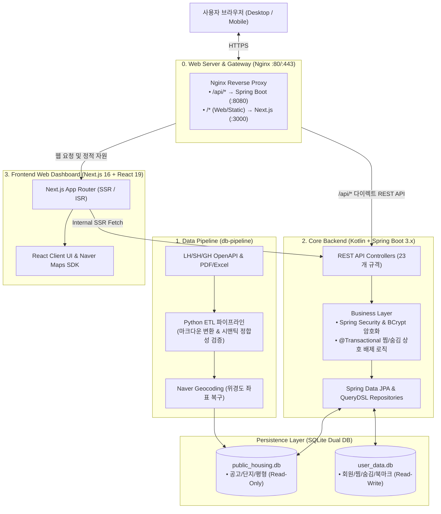

# PleaseHome (플리즈홈) - 통합 공공임대주택 대시보드 🏠

> 🌐 **실제 서비스 URL**: [https://pleasehome.com](https://pleasehome.com)

[](https://kotlinlang.org/)
[](https://spring.io/projects/spring-boot)
[](https://www.typescriptlang.org/)
[](https://nextjs.org/)
[](https://www.python.org/)
[](https://nginx.org/)
[](https://pm2.keymetrics.io/)
[](https://sqlite.org/)
[](https://opensource.org/licenses/MIT)

**PleaseHome(플리즈홈)**은 LH, SH, GH 등 공공기관에서 발행하는 방대하고 복잡한 임대주택 입주자 모집 공고를 정밀 분석하여, 사용자 친화적인 지도 기반 인터페이스로 제공하는 **3-Tier 풀스택 웹 서비스**입니다.

---

## 📐 시스템 아키텍처 (3-Tier Decoupled Architecture)

시스템의 안정성과 확장성을 위해 **데이터 수집(Python) - 백엔드 코어(Kotlin/Spring Boot) - 프론트엔드(Next.js)**의 책임을 엄격하게 3단계로 분리했습니다.



### 계층별 기술 스택 및 역할

| 계층 (Layer) | 기술 스택 (Tech Stack) | 주요 역할 및 핵심 책임 |
| :--- | :--- | :--- |
| **0. Gateway** | **Nginx, PM2** | SSL/TLS 종단, `/api/*` 스프링부트 다이렉트 라우팅, 프로세스 무중단 관리 |
| **1. Data Pipeline** | **Python 3.12, BeautifulSoup, OpenDataLoader** | 공공 OpenAPI 수집, 비정형 PDF 공고문 마크다운 변환 및 정합성 검증 |
| **2. Core Backend** | **Kotlin, Spring Boot 3.x, Spring Data JPA, SQLite** | 23개 REST API 서빙, 멀티 데이터소스 분리, `@Transactional` 비즈니스 무결성 |
| **3. Frontend** | **Next.js 16 (App Router), React 19, TailwindCSS v4** | 지도 인터페이스(Naver Maps SDK), SSR/ISR 검색엔진 최적화, 반응형 UI |

---

## 💡 백엔드 핵심 엔지니어링 하이라이트 (Engineering Challenges)

### 1. Kotlin + Spring Boot 3.x 3단 분리 및 Nginx 다이렉트 프록시
* **문제**: 모놀리스 구조에서 Next.js 서버가 DB 직접 접근과 API 라우팅을 모두 담당하여 비즈니스 로직 확장과 트랜잭션 관리에 한계가 존재함.
* **해결**: Kotlin과 Spring Boot 3.x 기반의 독립 REST API 코어 서버(`backend/`)를 구축하고 23개 규격의 REST API를 구현함. Nginx 레벨에서 `/api/*` 요청을 백엔드(`:8080`)로 직접 리버스 프록시하여 **Node.js 경유 지연(2중 홉)을 제거**함.

### 2. Dual SQLite DataSource 구축을 통한 무손실 배포 (Zero Data-Loss)
* **문제**: 신규 공고 데이터(`public_housing.db`)를 서버에 배포(scp)할 때 실서버 회원 계정 및 북마크 데이터가 함께 덮어씌워질 위험이 있음.
* **해결**: 공고 데이터(`public_housing.db`)와 회원 데이터(`user_data.db`)를 **물리적으로 2개의 독립 SQLite DB로 격리**하고, Spring Boot에서 `HousingDbConfig`와 `MemberDbConfig` 2개의 EntityManagerFactory로 분리 연동하여 **배포 덮어쓰기 시에도 회원 데이터의 100% 영속성을 보장**함. ([ADR #2](docs/dev/DECISION.md))

### 3. `@Transactional` 원자적 찜 ↔ 숨김 상호 배제 비즈니스 로직
* **문제**: 찜하기(긍정적 관심)와 숨김(부정적 관심) 상태가 동시에 존재하는 데이터 불일치 발생 가능성.
* **해결**: Service 계층에서 찜 등록 시 숨김 데이터를 즉시 삭제하고, 숨김 등록 시 찜 데이터를 즉시 삭제하는 상호 배제형 로직을 **`@Transactional(transactionManager = "memberTransactionManager")`을 통해 원자적으로 보장**함. ([ADR #1](docs/dev/DECISION.md))

### 4. N+1 SQL 쿼리 최적화 (300+ 쿼리 $\rightarrow$ 4개 단축)
* **문제**: 공고 1건마다 일정, 세부조건, 제한사항을 루프 순회하며 조회하여 N+1 쿼리 병목(단일 API 호출 시 300+ 쿼리) 발생.
* **해결**: 공고 목록 조회 시 연관 테이블들을 In-Memory Map으로 대량 조회(Bulk Fetch)하여 **SQL 쿼리 수를 4개로 대폭 절감(98% 감축)**하고 응답 속도를 극대화함. ([ADR #5](docs/dev/DECISION.md))

---

## 📋 REST API 엔드포인트 규격 (23 Endpoints)

Spring Boot 백엔드 코어 서버에서 제공하는 23개 RESTful API 전체 명세입니다.

| 도메인 (Domain) | Method | Endpoint | 설명 및 비즈니스 로직 | 인증/권한 |
| :--- | :--- | :--- | :--- | :--- |
| **공고 (Announcements)** | `GET` | `/api/announcements` | 전체 모집 공고 목록 및 연관 일정/조건 조회 | Public |
| | `GET` | `/api/announcements/{id}` | 특정 공고 단건 조회 | Public |
| | `GET` | `/api/announcements/{id}/details` | 공고 상세, 일정, 조건, 소속 단지 및 평형 종합 번들 (SSR 최적화) | Public |
| **단지 (Complexes)** | `GET` | `/api/complexes` | 전체 또는 공고별 단지 목록 조회 (`?announcement_id=`) | Public |
| | `GET` | `/api/complexes/{id}` | 특정 단지 단건 조회 | Public |
| | `GET` | `/api/complexes/{id}/details` | 단지 상세, 소속 평형 목록 및 동일 단지 과거 공고 이력 번들 | Public |
| **평형 & 사이트맵** | `GET` | `/api/housing-units` | 주택 평형 목록 조회 (`?complex_id=`, `?announcement_id=`) | Public |
| | `GET` | `/api/sitemap/paths` | 검색엔진(SEO)용 전체 공고 및 단지 ID 경로 목록 조회 | Public |
| **인증 (Auth)** | `POST` | `/api/auth/register` | 신규 회원가입 (BCrypt 암호화, 세션 쿠키 발급) | Public |
| | `POST` | `/api/auth/login` | 로그인 인증 (세션 쿠키 `pleasehome_session` 발급) | Public |
| | `POST` | `/api/auth/logout` | 로그아웃 (세션 쿠키 즉시 만료) | Public |
| | `GET` | `/api/auth/me` | 현재 세션 사용자 정보 조회 | Member |
| | `PATCH` | `/api/auth/update` | 비밀번호 및 보안 질문/답변 변경 | Member |
| | `GET` | `/api/auth/find-account` | 계정 찾기 보안 질문 조회 (`?id=`) | Public |
| | `POST` | `/api/auth/find-account` | 보안 답변 검증 및 비밀번호 재설정 | Public |
| **사용자 인터랙션** | `GET` | `/api/member/favorites` | 찜한 공고 ID 목록 조회 | Member |
| | `POST` | `/api/member/favorites` | 공고 찜 등록 (**숨김 자동 해제** - `@Transactional` 상호 배제) | Member |
| | `DELETE` | `/api/member/favorites` | 공고 찜 해제 | Member |
| | `GET` | `/api/member/hidden-anns` | 숨김 공고 ID 목록 조회 | Member |
| | `POST` | `/api/member/hidden-anns` | 공고 숨김 등록 (**찜 자동 해제** - `@Transactional` 상호 배제) | Member |
| | `DELETE` | `/api/member/hidden-anns/{id}` | 공고 숨김 해제 | Member |
| **북마크 (Bookmarks)** | `GET` | `/api/member/bookmark-folders` | 회원의 북마크 폴더 목록 조회 | Member |
| | `POST` | `/api/member/bookmark-folders` | 북마크 폴더 생성 및 수정 | Member |
| | `DELETE` | `/api/member/bookmark-folders/{id}` | 북마크 폴더 삭제 (**하위 북마크 아이템 동반 Cascade 삭제**) | Member |
| | `GET` | `/api/member/bookmark-items` | 북마크 저장 단지 목록 조회 | Member |
| | `POST` | `/api/member/bookmark-items` | 단지 북마크 저장 및 폴더 이동/메모 수정 | Member |
| | `DELETE` | `/api/member/bookmark-items/{id}` | 단지 북마크 삭제 | Member |

---

## 🖥️ 주요 서비스 기능 (Key Features)

```text
┌────────────────────────────────────────────────────────┐
│                 PleaseHome Dashboard Header            │
├───────────────────┬────────────────────────────────────┤
│                   │                                    │
│ [검색 및 필터]    │           [ Naver Map ]            │
│ - 기관 / 유형별   │ - 공급 단지별 마커 시각화          │
│ - 보증금/월세 락  │ - 마커 클릭 시 요약 팝업           │
│                   │                                    │
│ [모집 공고 목록]  │                                    │
│ - D-Day 타임라인  │                                    │
│ - 찜 / 숨김 관리  │                                    │
└───────────────────┴────────────────────────────────────┘
│ [우측 슬라이딩 상세 패널 (Detail Panel)]              │
│ - 평형별 임대보증금 / 월세 최대 상호전환 모의 계산기  │
└────────────────────────────────────────────────────────┘
```

* 🗺️ **대화형 지도 인터페이스**: 네이버 지도 SDK와 연동하여 수백 개 단지 마커를 브라우저 랙 없이 즉각 시각화 및 양방향 호버 연동.
* 🔍 **다차원 맞춤 필터링**: 공급 기관(LH/SH/GH), 임대 유형(행복주택/국민임대 등), 보증금/월세 구간 슬라이더 필터 지원.
* 📊 **평형별 임대 조건 & 전환보증금 계산기**: 단지 선택 시 우측 슬라이딩 패널에서 보증금 $\leftrightarrow$ 월세 전환 이율을 실시간 계산.
* ⏱️ **청약 생애주기 타임라인 & D-Day**: 접수 $\rightarrow$ 서류 $\rightarrow$ 당첨 $\rightarrow$ 계약 전 과정을 시각화된 단계별 게이지 바와 카운트다운 타이머로 제공.
* 📂 **드래그앤드롭(DnD) 관심 단지 폴더 관리**: 북마크 탭에서 단지 카드를 드래그하여 폴더별로 자유롭게 분류/이관.
* 🌙 **전역 다크모드 (Dark Mode)**: 네이버 지도 타일 반전 및 슬레이트 톤 야간 모드 완비.

---

## 📂 프로젝트 구조 (Project Structure)

```text
pleasehome/
├── backend/                        # 코어 백엔드 서버 (Kotlin + Spring Boot 3.x)
│   ├── src/main/kotlin/            # 엔티티, JPA 리포지토리, 서비스, 23개 REST 컨트롤러
│   │   ├── config/                 # Housing / Member 독립 Dual DataSource & CORS 설정
│   │   ├── housing/                # 공고/단지/평형/사이트맵 도메인
│   │   └── member/                 # 인증/회원/찜/숨김/북마크 도메인 (@Transactional)
│   ├── src/test/kotlin/            # Spring Boot + SQLite 통합 테스트
│   └── build.gradle.kts            # Gradle 의존성 (JPA, SQLite JDBC, Security Crypto)
├── web/                            # 웹 프론트엔드 (Next.js 16.x + React 19)
│   ├── src/app/                    # App Router 기반 페이지 (SSR/ISR 정적 최적화)
│   ├── src/components/             # 네이버 지도, 사이드바, 필터, 북마크 DnD 컴포넌트
│   ├── src/lib/api.ts              # Spring Boot REST API 통신 모듈
│   └── package.json                # React 19, TailwindCSS v4
├── db-pipeline/                    # 데이터 파이프라인 (Python 3.12.x)
│   ├── src/lh_notice/              # LH OpenAPI 통신 및 원본 PDF/Excel 수집
│   ├── public_housing.db           # 정제 적재된 SQLite3 공고 DB
│   └── user_data.db                # 실서버 회원/인증 독립 SQLite3 DB
├── docs/dev/                       # 설계 문서 (ARCHITECTURE.md, DECISION.md, TROUBLESHOOTING.md)
├── command.sh                      # 로컬 실행, 테스트, 빌드 및 실서버 원클릭 배포 쉘 스크립트
├── .gitignore                      # 통합 형상 관리 예외 규칙
└── README.md                       # 프로젝트 메인 포트폴리오 문서
```

---

## 🛠️ 개발 환경 구축 및 실행 가이드 (Getting Started)

### 1. 사전 요구사항 (Prerequisites)
* **Java**: OpenJDK 17 이상
* **Node.js**: v20.x 이상 (npm v10+)
* **Python**: v3.12.x 이상
* **Database**: SQLite 3.x 이상

### 2. 로컬 개발 서버 실행 ([`command.sh`](file:///home/iru/app/pleasehome/command.sh))

```bash
# [1] Spring Boot 백엔드 서버 기동 (포트 8080)
./command.sh backend:run

# [2] Next.js 프론트엔드 대시보드 기동 (포트 3000)
./command.sh web:run

# [3] 백엔드 단위 및 통합 테스트 실행
./command.sh backend:test
```
* 서버 가동 후 브라우저를 통해 [http://localhost:3000](http://localhost:3000)에 접속합니다.

### 3. 실서버 원클릭 무중단 배포 (Zero-Downtime Deploy)

```bash
# Nginx + PM2(pleasehome + pleasehome-backend) 기반 통합 빌드 및 원클릭 배포
./command.sh deploy
```

---

## 📑 아키텍처 및 의사결정 문서 (SSOT Documentation)

* 📐 **[서비스 아키텍처 명세서 (ARCHITECTURE.md)](docs/dev/ARCHITECTURE.md)**: 3-Tier 시스템 구성도, 데이터 흐름도 및 23개 REST API 엔드포인트 전체 규격서
* ⚖️ **[설계 의사결정 기록 (DECISION.md)](docs/dev/DECISION.md)**: Kotlin/Spring Boot 전환(ADR #11), Dual DB 분리(ADR #2), 상호 배제 트랜잭션(ADR #1) 등 12건의 ADR
* 🚨 **[트러블슈팅 및 문제 해결 기록 (TROUBLESHOOTING.md)](docs/dev/TROUBLESHOOTING.md)**: Nginx 리버스 프록시 연동, SSR Hydration, N+1 쿼리 최적화 등 기술적 문제 해결 이력

---

## 📜 라이선스 (License)

본 프로젝트는 [MIT License](LICENSE) 하에 배포 및 관리됩니다.
