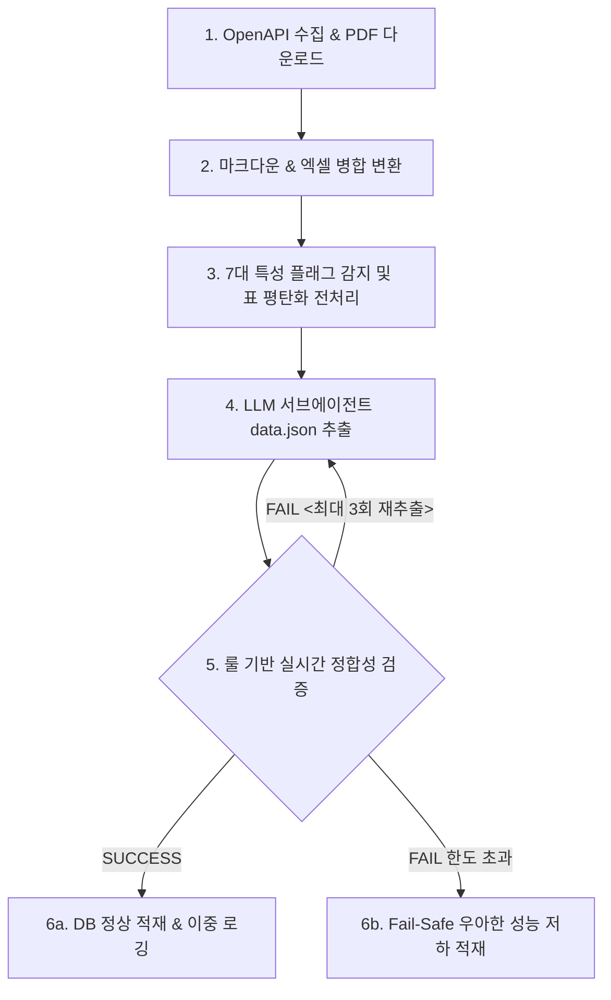

# PROJECT.md

이 파일은 `backend`의 물리적인 개발 환경, 폴더 구조, 실행 명령어 규약 및 데이터 정제/적재 파이프라인을 정의합니다. 에이전트와 개발자는 작업을 시작하기 전 이 사양을 반드시 숙지해야 합니다.

---

## 1. 개발 환경 & 시스템 의존성 (Environment & Dependencies)

* **언어**: Python 3.12.x (Python 3.x 호환)
* **가상 환경**: 시스템 파이썬 보호(PEP 668) 정책에 따라 반드시 가상환경(`.venv`) 내에서 의존성을 격리하여 작동해야 합니다.
* **주요 패키지 명세 및 역할**:
  * `requests` (v2.34.2): LH/국토교통부 OpenAPI 통신 및 데이터 수집
  * `python-dotenv` (v1.2.2): 환경 변수(`.env.local`) 로드 및 API 인증키 관리
  * `opendataloader-pdf` (v2.4.7): PDF 임대 공고문 문서를 파싱하여 마크다운(`document.md`)으로 자동 변환
  * `python-docx` (v1.2.0) & `openpyxl` (v3.1.5): 한글/워드 및 엑셀 포맷의 공고문 원천 데이터 파싱 지원
  * `lxml` (v6.1.1): XML 기반 공공 API 데이터 구문 해석
* **환경 변수 사양**: `.env.local` 파일에 LH OpenAPI 인증키(`LH_NOTICE_LIST_API_KEY`, `LH_NOTICE_DTL_API_KEY`)를 보관하여 호출합니다.

---

## 2. 상세 폴더 구조 및 파일 명세 (Directory Layout & File Mapping)

```text
backend/
├── .venv/                          # Python 가상 환경 폴더 (Git 추적 배제)
├── .agents/                        # AI 에이전트 개발 지침 및 자동화 스크립트 폴더
│   ├── agent/                      # 에이전트 설정 템플릿
│   │   └── markdown_sql_parser/    # 마크다운 데이터 파싱용 agent.json 정의 경로
│   ├── scripts/                    # 파이프라인 코어 스크립트 7종
│   │   ├── convert_pdf_to_md.py    # PDF/엑셀 파일을 표준 마크다운 및 리소스로 변환/정리하는 도구
│   │   ├── pre_processor.py        # 7대 특성 플래그 감지 및 노이즈 슬라이싱, 표 평탄화 전처리
│   │   ├── hybrid_parser.py        # table_map의 이중 맵 조인 또는 단일 매핑 가이드에 의거해 complexes/units 병합을 완결하는 도구
│   │   ├── critic_validator.py     # 데이터 적재 전 실시간 룰 기반 정합성 물리 검증
│   │   ├── insert_loader.py        # SQLite DB 정상 적재 및 Fail-Safe 이중 로깅 적재 완결
│   │   ├── db_init.py              # SQLite DB 스키마 초기 선언 및 리셋 스크립트
│   │   └── audit_db.py             # 데이터 정합성 사후 감사 검증 스크립트 (단발성)
│   └── skills/                     # 에이전트 전문 스킬 정의 (extract-data, note 등)
├── src/
│   └── lh_notice/                  # OpenAPI 데이터 수집 코어 엔진
│       ├── api.py                  # 목록/상세/공급/단지정보 4종 통합 OpenAPI 연동 모듈
│       └── main.py                 # API 수집 및 PDF 다운로드 스크립트
├── docs/                           # 문서 보관 디렉토리
│   ├── api-guide/                  # 국토교통부/LH API 명세서 가이드 문서 (docx, md)
│   ├── dev/                        # 백엔드 트러블슈팅(TROUBLESHOOTING.md) 및 설계 보관
│   ├── pdf/                        # OpenAPI를 통해 수집된 원본 PDF 공고문 저장소
│   └── md/                         # PDF에서 마크다운 변환된 공고문 및 정제 data.json 물리 보존소
├── public_housing.db               # SQLite3 관계형 데이터베이스
├── test_api.py                     # API 연결성 테스트용 스크립트
├── AGENTS.md                       # 에이전트 행동 지침 및 사용자가 직접 수립한 누적 규칙
└── PROJECT.md                      # 본 프로젝트 사양 및 실행 명령어 가이드 문서 (SSOT)
```

---

## 3. 핵심 데이터 적재 파이프라인 (Data Pipeline Flow)

### 3.1. 파이프라인 전체 워크플로우 개요
본 파이프라인은 LH OpenAPI 등을 통해 수집한 분양/임대 공고문(PDF, Excel)을 마크다운으로 구조화한 후, 7대 기본 특성에 맞춰 LLM 서브에이전트가 정제하고, 룰 기반 검증을 거쳐 SQLite3 관계형 DB([public_housing.db](file:///home/iru/app/pleasehome/backend/public_housing.db))에 최종 적재하는 파이프라인입니다.

전체적인 처리 흐름은 아래와 같습니다.



### 3.2. 단계별 스크립트 역할 및 핵심 로직 분석

#### 1단계: OpenAPI 데이터 수집 및 원천 PDF 다운로드
* **수행 모듈**: [api.py](file:///home/iru/app/pleasehome/backend/src/lh_notice/api.py), [main.py](file:///home/iru/app/pleasehome/backend/src/lh_notice/main.py)
* **동작 방식**:
  * LH OpenAPI를 통해 분양임대공고 목록 및 상세 정보를 수집합니다.
  * 첨부파일 중에서 `.pdf`, `.xls`, `.xlsx` 확장자를 필터링하고 화이트리스트("공고", "모집", "안내", "목록", "주택" 포함 여부)에 해당하는 파일들을 `docs/pdf/` 디렉토리에 다운로드합니다.
  * 동시에 수집 대상의 메타데이터(공고명, 청약유형, 상세URL 등)를 [download_meta.json](file:///home/iru/app/pleasehome/backend/docs/pdf/download_meta.json)에 기록하여 후속 단계에서 연계할 수 있게 보존합니다.

#### 2단계: PDF/엑셀의 표준 마크다운 변환 및 정리
* **수행 모듈**: [convert_pdf_to_md.py](file:///home/iru/app/pleasehome/backend/.agents/scripts/convert_pdf_to_md.py)
* **동작 방식**:
  * `docs/pdf/`에 다운로드된 원천 문서들을 분석하여 고유 표준 공고 폴더명(`{연도}_{차수}_{청약유형}_{시행기관}_{시퀀스}`)을 생성하고, 파일들을 해당 폴더로 자동 그룹화 이동합니다.
  * PDF는 `opendataloader-pdf` 패키지를 사용해 마크다운 텍스트와 이미지 리소스로 분리 변환하고, 엑셀(`xlsx`) 주택 목록 등은 마크다운 표(`Table`) 형태로 파싱합니다.
  * 공고문 PDF → 일반 PDF → 엑셀 시트 순으로 정렬 후 단일 마크다운 파일(document.md)로 최종 병합합니다.

#### 3단계: 기본 특성 감지 및 전처리
* **수행 모듈**: [pre_processor.py](file:///home/iru/app/pleasehome/backend/.agents/scripts/pre_processor.py)
* **동작 방식**:
  * **7대 기본 특성 플래그 감지**: 본문 텍스트와 제목을 기반으로 아래의 비즈니스적 특성을 정밀 분석하여 판별합니다.
    1. `has_complexes`: 실물 단지가 존재하는지 여부 (예: '전세임대'는 물리 단지가 부재하므로 `False`)
    2. `is_distributed`: 상세 주택 내역이 본문이 아닌 외부 링크/첨부파일 등으로 분산되었는지 여부
    3. `is_income_linked`: 소득 분위별 임대조건 차등 조건 존재 여부
    4. `is_deposit_optional`: 기본형 외 보증금 비율 선택 옵션 제공 여부
    5. `is_reserve_only`: 신규 입주가 아닌 예비 입주자 모집 공고 여부
    6. `has_mutual_conversion`: 상호전환 가능 여부
    7. `has_unstandardized_address`: 임시 지구 블록명 등 비정형 주소 사용 여부
  * **표 평탄화 (Table Flatting)**: 빈 셀 병합으로 인해 LLM이 텍스트 구조를 오해하는 것을 방지하고자, 전방 충전(Forward Fill) 알고리즘으로 빈 셀을 위 셀의 값으로 보완한 [document_flat.md](file:///home/iru/app/pleasehome/backend/docs/md/document_flat.md)를 생성합니다.
  * **노이즈 절삭 (Noise Slicing)**: 문서 후반부의 불필요한 행정 서식(위임장, 동의서 등)을 절삭(Cutoff)하여 토큰 낭비를 차단합니다.

#### 4단계: 서브에이전트 가동을 통한 정제 JSON 데이터 추출
* **수행 모듈**: [agent.json](file:///home/iru/app/pleasehome/backend/.agents/agent/markdown_sql_parser/agent.json) 기반의 서브에이전트(`markdown_sql_parser_v4`)
* **동작 방식**:
  * 부모 에이전트로부터 전달받은 7대 특성 플래그와 [document_flat.md](file:///home/iru/app/pleasehome/backend/docs/md/document_flat.md)를 바탕으로, 비즈니스 룰 및 DB 제약 조건에 적합한 JSON 스펙 데이터를 추출하여 [data.json](file:///home/iru/app/pleasehome/backend/docs/md/data.json)으로 저장합니다.
  * 예: `is_reserve_only`가 True면 모든 유닛의 공급 수(`supply_count`)를 0으로 맞추고 예비 수(`reserve_count`)를 매핑하며, `has_unstandardized_address`가 True면 웹 검색을 가동해 정식 번지 주소를 보완합니다.

#### 5단계: 룰 기반 실시간 정합성 물리 검증
* **수행 모듈**: [critic_validator.py](file:///home/iru/app/pleasehome/backend/.agents/scripts/critic_validator.py)
* **동작 방식**:
  * DB 적재 직전에 비즈니스 정합성을 엄격하게 강제 검증합니다.
  * 17대 광역지자체 공식 지역명 및 시행기관 매핑 상태 검증.
  * `has_complexes` 플래그의 상호 배타성(True 시 `limits`는 반드시 `[]`, False 시 `complexes`/`units`는 반드시 `[]`인지 등) 검증.
  * 날짜 형식 준수 및 순서 논리(신청접수 → 당첨자발표 → 계약체결) 검증.
  * 상호전환 범위와 보증금 증액 시 임대료 감액 등의 수학적 관계 검증.
  * 오류 발생 시 서브에이전트에게 구체적인 텍스트 피드백을 전달하여 최대 3회까지 재작업을 요청(피드백 루프)합니다.

#### 6단계: DB 적재 및 안전 격리 (Fail-Safe)
* **수행 모듈**: [insert_loader.py](file:///home/iru/app/pleasehome/backend/.agents/scripts/insert_loader.py)
* **동작 방식**:
  * **정상 적재 (SUCCESS)**: 실시간 검증을 통과한 JSON 정제 데이터를 DB 트랜잭션 단위로 최종 적재합니다. 이때, 기존에 매치되는 문서 경로(`doc_path`)가 이미 존재하면 CASCADE 형태로 말끔하게 정리(Delete & Insert)합니다.
  * **우아한 성능 저하 적재 (FAIL - Fail-Safe)**: 파싱에 최종 실패하거나 검증 한도(3회)를 초과해 롤백 에러가 날 경우, `insert_loader.py`에 `--status FAIL` 옵션을 주어 실행합니다. 이 모드에서는 announcements 테이블에 최소 메타데이터만 기재하고, 관계형 데이터 대신 세부 조회용 `announcement_details` 테이블에 공고문 원본 마크다운을 통째로 적재해 두어 사용자가 원본 조회를 할 수 있도록 설계되어 있습니다.

---

## 4. 표준 실행 명령어 규약 (Standard Execution Protocols)

### 4.1. 가상환경 활성화 및 API 수집기 구동
```bash
# 가상환경 활성화
source .venv/bin/activate

# LH OpenAPI 수집 파이프라인 실행 (PDF 다운로드 포함)
python src/lh_notice/main.py
```

### 4.2. PDF/엑셀 원천 문서 표준 마크다운 변환 및 정리
```bash
# 1. 미분류 PDF/엑셀 스캔 및 자동 표준 폴더화/마크다운 병합 변환 실행 (자동 모드)
python .agents/scripts/convert_pdf_to_md.py

# 2. 특정 PDF 파일에 대해 직접 표준화 및 마크다운 개별 변환 실행 (수동 지정 모드)
python .agents/scripts/convert_pdf_to_md.py docs/pdf/{공고_폴더}/origin.pdf
```

### 4.3. 7대 기본 특성 감지 및 노이즈 절삭/표 평탄화 전처리
```bash
# 특정 공고 마크다운 파일에 대해 전처리 실행 (features.json 및 document_flat.md 생성)
python .agents/scripts/pre_processor.py docs/md/{공고_폴더}/document.md
```

### 4.4. 추출 데이터 실시간 검증 및 DB 적재
```bash
# 1. 룰 기반 실시간 정합성 검증 실행
python .agents/scripts/critic_validator.py docs/md/{공고_폴더}/data.json docs/md/{공고_폴더}/features.json

# 2. 검증 통과 시 DB 정상 적재 완결 (source와 backup 경로 지정)
python .agents/scripts/insert_loader.py docs/md/{공고_폴더}/data.json docs/md/{공고_폴더}/data.json

# 3. [Fail-Safe] 검증 최종 실패 시 우아한 성능 저하 적재 (마크다운 전체 텍스트 이중 로깅)
python .agents/scripts/insert_loader.py --doc_path docs/md/{공고_폴더}/document.md --status FAIL --error_message "검증 에러 내용"
```

---

## 5. 형상 관리 (Git) 규약

* **`.gitignore` 준수 절대 원칙**: `.gitignore`에 명시되어 추적이 배제된 환경 통제 파일(`AGENTS.md`, `docs/` 디렉토리 등)을 억지로 커밋하기 위해 **`git add -f` (강제 추가) 옵션을 사용하는 행위를 일절 금지**합니다. 변경된 소스 코드만 정상적으로 `git add`하여 커밋합니다.
* **커밋 메시지 규약**: Git 커밋 메시지는 무조건 한글로 작성하며, 커밋 스타일 규칙([.agents/commit_convention.md](file:///.agents/commit_convention.md))을 따릅니다.

---

## 6. 데이터 파싱 및 수집 세부 규약 (Data Extraction & Parsing Rules)

데이터 파싱 및 데이터베이스 적재 시 데이터 일관성과 정합성을 유지하기 위해 아래 규약을 철저히 준수합니다.

### 6.1. 원천 데이터 신뢰 및 전처리 원칙
* **원천 데이터 신뢰**: 파싱 및 가공 시 외부 폴더명 등 가변적 정보에 의존하지 않고, 오직 대상 마크다운 파일(`document.md`) 본문의 텍스트 및 표 콘텐츠만 원천 데이터로 삼습니다.
* **행정 서식 제외**: 개인정보 동의서, 위임장, 빈 서식 양식 등 행정용 별첨 텍스트는 노이즈 데이터로 취급하여 수집 대상에서 제외합니다.
* **위치 정보 좌표 변환 위임**: 주택 위치 정보(위도, 경도)는 DB에 고정 저장하지 않고, 주소(`address`) 정보만 적재한 뒤 클라이언트단 Geocoder 라이브러리의 동적 변환에 위임합니다.
* **정제 데이터 상대 경로 보존**: 서브에이전트가 추출한 JSON은 `docs/md/{공고_폴더}/data.json`에 물리 보관하며, DB 적재 시 절대 경로가 하드코딩되지 않도록 프로젝트 루트 기준 상대 경로로 변환하여 환경 이식성을 보장합니다.

### 6.2. 7-Feature Logic 및 추출 대응 규칙
오케스트레이터 및 서브에이전트는 감지된 7대 기본 특성 플래그에 따라 다음과 같이 동작을 제한합니다.
1. **`has_complexes` (실물 단지 존재 여부)**:
   * `False` (예: 전세임대 등): complexes와 units 배열은 `[]`로 강제하고, 대출/전세 지원한도 정보를 `limits` 배열에 정밀 매핑합니다.
   * `True`: 물리 단지 및 평형(complexes, units) 정보를 추출하고, `limits` 배열은 반드시 빈 배열 `[]`로 강제합니다. 소득/자산 기준 등은 `details` 배열의 '소득 및 자산 기준' 섹션에 줄글로만 요약 수록합니다.
2. **`is_distributed` (상세 주택내역 분산 여부)**:
   * `True` (본문에 상세 주택 목록 표가 없고 외부 첨부물로 우회된 경우): units는 빈 배열 `[]`로 세팅하고 기본 룰을 `limits`/`details`에 기록합니다.
3. **`is_income_linked` (소득 연계 임대조건 여부)**:
   * `True`: 소득 분위/구간(1~6구간 등)별로 유닛 데이터를 각각 복제하여 `income_group` 필드를 분리 생성하고 해당하는 보증금/임대료를 각각 추출합니다.
4. **`is_deposit_optional` (보증금 비율 선택 옵션 여부)**:
   * `True`: 선택 보증금 비율(예: 30%, 35%, 40%)에 맞춰 유닛 데이터를 각각 복제 생성하여 적재합니다.
5. **`is_reserve_only` (예비입주자 단독 모집 여부)**:
   * `True`: 모든 유닛의 공급 수(`supply_count`)를 `0`으로 일괄 강제하며, 모집 정량 인원은 예비자수(`reserve_count`)에 매핑합니다.
6. **`has_mutual_conversion` (상호전환 지원 여부)**:
   * `False`: 상호전환 범위 금액 필드(`max_deposit`, `min_deposit`, `max_monthly_rent`, `min_monthly_rent`)를 모두 `null`로 지정합니다.
7. **`has_unstandardized_address` (비정형 주소 여부)**:
   * `True` (예: "도내동 외 일원 고양창릉 공공주택지구 내 A-4블록" 등): 서브에이전트가 주소를 추출하는 시점에 반드시 웹 검색(`search_web`)을 수행하여 공식 지번/도로명 주소를 찾아 대체하여 기재합니다.

### 6.3. 대표 지역(region) 명세 표준화
* `region` 필드는 임의의 줄임말(예: "서울", "경기")이나 다중 텍스트를 배제하고, 오직 대한민국의 **17대 표준 광역지방자치단체명** 중 정확히 하나로 정규화하여 기재합니다:
  > `서울특별시, 부산광역시, 대구광역시, 인천광역시, 광주광역시, 대전광역시, 울산광역시, 세종특별자치시, 경기도, 강원도, 충청북도, 충청남도, 전북특별자치도, 전라남도, 경상북도, 경상남도, 제주특별자치도`

### 6.4. 청약 유형 표준 사전 (Subscription Type Standards)
| 표준 분류명 (Folder Type) | 공식 한글 명칭 | 소속 기관 | 설명 |
| :--- | :--- | :--- | :--- |
| **`행복주택`** | 행복주택 | LH, SH | 대학생, 청년, 신혼부부 등 젊은 층 대상 임대 |
| **`장기전세`** | 장기전세주택 | LH, SH | 주변 시세 80% 이하, 최장 20년 전세 임대 |
| **`장기전세2`** | 장기전세주택2 (미리내집) | SH | 서울시 저출생 대책 신혼부부 전용 장기전세 |
| **`국민임대`** | 국민임대주택 | LH, SH | 무주택 저소득 서민 대상 장기 임대 (최대 30년) |
| **`영구임대`** | 영구임대주택 | LH, SH | 기초생활수급자 등 최취약계층 대상 임대 (최대 50년) |
| **`통합공공임대`** | 통합공공임대주택 | LH | 국민/영구/행복주택을 하나로 통합한 신규 임대 유형 |
| **`공공임대`** | 공공임대주택 | LH, SH | 일정 기간 임대 거주 후 분양전환하는 임대. 50년 임대도 포함 |
| **`50년공공임대`** | 50년 공공임대주택 | LH | 반영구적 장기 공공임대 (폴더 및 DB 명칭 유지) |
| **`매입임대`** | 매입임대주택 | LH, SH | 공사가 기존 주택을 매입하여 시세보다 저렴하게 임대 |
| **`특화형매입임대`** | 특화형 매입임대주택 | GH, SH | 사회적 경제주체가 매입임대주택을 활용해 주거서비스를 제공하는 임대 |
| **`전세임대`** | 전세임대주택 | LH, SH | 입주자가 고른 민간 주택을 공사가 전세 계약 후 재임대 |
| **`든든전세`** | 든든전세주택 | LH, HUG | HUG/LH가 주택을 직접 확보하여 공급하는 전세주택 |
| **`청년안심`** | 청년안심주택 | SH | 역세권 청년 및 신혼부부 대상 임대 |
| **`장기안심`** | 장기안심주택 | SH | 서울시 보증금 지원형 전세임대 |
| **`희망하우징`** | 희망하우징 | SH | 대학생 전용 쉐어하우스형 매입임대 |

### 6.5. DB 제약조건 대응 방어적 기본값 규칙
* **전용면적 (`exclusive_area`)**: 면적 수치가 누락되었거나 존재하지 않는 경우 `null` 대신 기본값 `0.0`으로 정규화 기록합니다.
* **임대보증금 (`deposit`)**: 보증금 정보가 없거나 누락된 경우 `null` 대신 기본값 `0`으로 기록합니다.
* **상세 정보 (`details`) 내 필수 키**: details 배열 내의 모든 마크다운 텍스트 키는 반드시 `"section_content"`를 사용해야 하며, `"sort_order"`(정수형) 키가 누락되지 않아야 합니다.
* **단지 정보 (`complexes`) 내 필수 키**: complexes 배열 내의 `"name"`과 `"address"`는 결코 null이거나 빈 문자열일 수 없으며, 주소의 "외 일원" 등의 미사여구는 정화(`clean_address` 함수)하여 적재합니다. 신설된 `"complex_type"` 필드는 `housing_units`의 개별 호수 attributes 내 주택 유형(예: '유형: 오피스텔') 혹은 본문의 정보를 토대로 '아파트', '오피스텔', '다가구주택', '도시형생활주택' 등 대표 유형으로 추출하여 정규화 기록하며, 불명확할 경우 `null`을 허용합니다.

