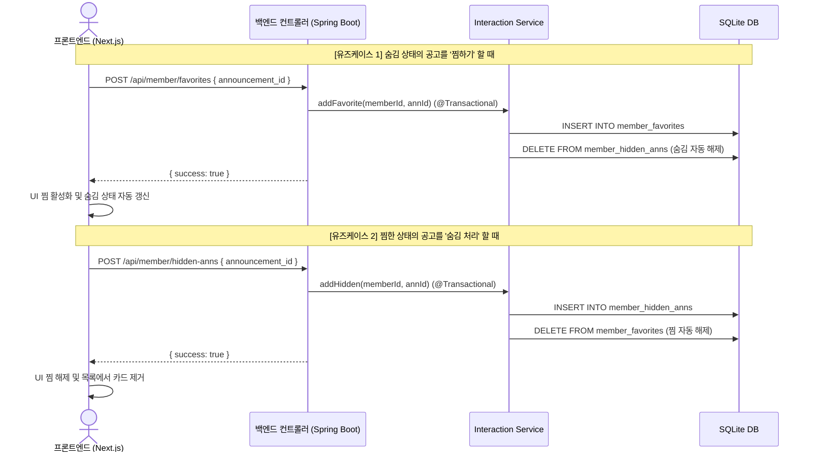

# 서비스 아키텍처 명세서 (Service Architecture Specification)

본 문서는 **PleaseHome (플리즈홈)** 서비스의 전역 시스템 아키텍처, 3단 계층 분리(3-Tier Decoupled Architecture), 컴포넌트 간 상호작용 및 RESTful API 규격 정보를 기술합니다.

---

## 1. 아키텍처 설계 철학 (Architecture Philosophy)

안정적인 대규모 공고 데이터 가공과 실시간 웹 서비스의 신뢰성을 위해 **데이터 파이프라인(db-pipeline) - 백엔드 코어(backend) - 프론트엔드 대시보드(web)**의 책임을 엄격하게 3단계로 격리합니다.

* **1. 데이터 적재 계층 (`db-pipeline`)**: 무거운 비정형 데이터(PDF/Excel) 파싱, 지오코딩 및 데이터 정합성 검증을 담당하며, 정제된 SQLite DB(`public_housing.db`)로 데이터를 영속화합니다.
* **2. 백엔드 코어 계층 (`backend`)**: Kotlin + Spring Boot 3.x 기반으로 구동되며, Spring Data JPA와 QueryDSL을 통해 영속 계층을 추상화하고, 회원 인증/인가(Spring Security) 및 찜/숨김 상호 배제 비즈니스 트랜잭션(@Transactional)을 안전하게 처리하며 23개 RESTful API를 서빙합니다.
* **3. 프론트엔드 대시보드 계층 (`web`)**: Next.js 15 (App Router) + React 19 기반으로 구동되며, 검색엔진 최적화(SEO) 및 구글 애드센스를 위한 정적 SSR/ISR 렌더링과 클라이언트 사이드 대화형 지도(Naver Maps SDK) 및 슬라이딩 패널 UI를 제공합니다. 모든 데이터 통신은 백엔드 REST API로 단일화됩니다.

---

## 2. 전체 시스템 아키텍처 및 데이터 흐름 (System Layout)

```mermaid
flowchart TB
    %% 1. 외부 데이터 소스 및 클라이언트
    subgraph External["External Services & Clients"]
        LH_SH["LH / SH / GH 공공데이터 API<br>& 공고문 PDF/Excel"]
        NaverGeo["Naver Geocoding API"]
        NaverMap["Naver Maps SDK"]
        Browser["사용자 브라우저<br>(Desktop / Mobile)"]
        SearchBot["Google / Naver 검색봇<br>(SEO & 크롤러)"]
    end

    %% 2. 데이터 파이프라인 계층
    subgraph Pipeline["1. Data Pipeline (db-pipeline)"]
        Fetch["OpenAPI Fetcher & PDF Downloader<br>(Python)"]
        Parser["비정형 공고문 마크다운 변환<br>& 시맨틱 정합성 검증 (extract-data)"]
        Geo["위경도 좌표 복구 & 매핑 (Geocoding)"]
        Fetch --> Parser --> Geo
    end

    %% 3. 데이터베이스 계층
    subgraph Storage["Persistence Layer (SQLite DB)"]
        direction TB
        HousingDB[("public_housing.db<br>• announcements<br>• announcement_schedules<br>• announcement_details<br>• complexes (위경도 포함)<br>• housing_units")]
        UserDB[("user_data.db<br>• members<br>• member_favorites<br>• member_hidden_anns<br>• member_bookmark_folders<br>• member_bookmark_items")]
    end

    %% 4. 백엔드 코어 서버
    subgraph Backend["2. Core Backend (Kotlin + Spring Boot 3.x)"]
        direction TB
        Controller["REST API Controllers (23개 규격)<br>• /api/announcements/*<br>• /api/complexes/*<br>• /api/auth/*<br>• /api/member/*"]
        
        subgraph BizLogic["Business & Security Layer"]
            AuthSec["Spring Security & Auth Service<br>(인증/세션/비밀번호 변경)"]
            HousingBiz["Housing Service & QueryDSL<br>(공고·단지 조회 및 종합 상세 번들링)"]
            ToggleBiz["Interaction Service (@Transactional)<br>(찜 ↔ 숨김 상호 배제 로직 & 북마크)"]
        end

        Repo["Spring Data JPA & QueryDSL Repositories"]
        
        Controller --> BizLogic
        BizLogic --> Repo
    end

    %% 5. 프론트엔드 대시보드
    subgraph Frontend["3. Frontend Web Dashboard (web)"]
        direction TB
        
        subgraph SSR["Next.js App Router (SSR / ISR)"]
            SSR_Pages["• / (홈 메인 ISR)<br>• /announcements/details/[id]<br>• /complexes/[complexId]<br>• /sitemap.ts"]
        end

        subgraph ClientUI["React Client Components"]
            Layout["HomeClientLayout"]
            Sidebar["Sidebar (Search/Complex/Bookmark/More)"]
            MapComp["Naver Map Component"]
            Panel["DetailPanel (Sliding Drawer)"]
            MobileSheet["Mobile BottomSheet (Gesture)"]
        end

        SSR_Pages --> ClientUI
    end

    %% 연결 관계 (Data Flow)
    LH_SH --> Fetch
    Geo <-->|좌표 변환| NaverGeo
    Geo -->|정제 데이터 벌크 적재| HousingDB

    Repo <--> HousingDB
    Repo <--> UserDB

    SSR_Pages -->|Internal Fetch (REST API)| Controller
    ClientUI -->|Client Fetch (REST API)| Controller

    NaverMap --> MapComp
    Browser <--> ClientUI
    SearchBot -->|정적 HTML / JSON-LD 수집| SSR_Pages
```

---

## 3. 회원 연동 및 찜/숨김 데이터 모델 (Member Toggles)

회원의 맞춤형 개인 정보(찜 공고, 숨김 공고, 북마크)를 관계형 스키마로 영속화하며 백엔드 트랜잭션 계층에서 정합성을 통제합니다.

### 3.1. 관련 테이블 스키마 정의
* **`member_hidden_anns` (숨김 공고 테이블)**: 회원 ID(`member_id`)와 공고 ID(`announcement_id`) 복합 기본키
* **`member_favorites` (찜한 공고 테이블)**: 회원 ID(`member_id`)와 공고 ID(`announcement_id`) 복합 기본키
* **`member_bookmark_folders` (북마크 폴더 테이블)**: 폴더 ID(`id`), 회원 ID(`member_id`), 폴더명(`name`), 색상(`color`)
* **`member_bookmark_items` (북마크 단지 테이블)**: 회원 ID(`member_id`), 단지 ID(`complex_id`), 폴더 ID(`folder_id`), 메모(`memo`)

### 3.2. 상호 배타적 제어 로직 (Exclusive Toggling Architecture)
찜하기(긍정적 관심)와 숨김(부정적 관심) 상태는 논리적으로 공존할 수 없기 때문에 백엔드 Service 계층에서 **상호 배제형(Option A) 원자적 트랜잭션**을 보장합니다.



---

## 4. 백엔드 RESTful API 엔드포인트 규격 (Full API Reference - 23개)

### 4.1. 공고 및 단지 데이터 도메인 (Core Housing - 7개)
| Method | Endpoint | 설명 | Request / Query |
| :--- | :--- | :--- | :--- |
| `GET` | `/api/announcements` | 전체 공고 목록 조회 (일정/상세안내/한도액 포함) | None |
| `GET` | `/api/announcements/{id}/details` | 공고 종합 상세 번들 조회 (SSR 전용) | Path: `id` |
| `GET` | `/api/complexes` | 단지 목록 조회 | Query: `announcement_id` (선택) |
| `GET` | `/api/complexes/{id}/details` | 단지 상세 및 과거 동일 단지 공고 이력 조회 (SSR 전용) | Path: `id` |
| `GET` | `/api/housing-units` | 평형별 세부 조건 조회 | Query: `complex_id` 또는 `announcement_id` |
| `GET` | `/api/sitemap/paths` | 검색엔진 사이트맵 생성용 전체 ID 목록 조회 | None |

### 4.2. 인증 및 회원 관리 도메인 (Auth & Account - 6개)
| Method | Endpoint | 설명 | Request Body |
| :--- | :--- | :--- | :--- |
| `POST` | `/api/auth/register` | 신규 회원가입 | `{ id, password, security_q, security_a }` |
| `POST` | `/api/auth/login` | 로그인 및 세션/토큰 발급 | `{ id, password }` |
| `POST` | `/api/auth/logout` | 로그아웃 (세션 무효화) | None |
| `GET` | `/api/auth/me` | 로그인 회원 정보 조회 | Auth Header / Cookie |
| `PATCH` | `/api/auth/update` | 비밀번호 또는 보안 질문/답변 변경 | `{ current_password, new_password, ... }` |
| `POST` | `/api/auth/find-account` | 보안 질문 확인 및 비밀번호 재설정 | `{ id, security_a, new_password? }` |

### 4.3. 사용자 인터랙션 도메인 (Favorites / Hidden / Bookmarks - 10개)
| Method | Endpoint | 설명 | 비고 |
| :--- | :--- | :--- | :--- |
| `GET` | `/api/member/favorites` | 찜한 공고 목록 조회 | `[ { announcement_id, favorited_at } ]` |
| `POST` | `/api/member/favorites` | 공고 찜 등록 | **숨김 등록 시 자동 해제** |
| `DELETE` | `/api/member/favorites/{annId}` | 공고 찜 해제 | Path: `annId` |
| `GET` | `/api/member/hidden-anns` | 숨긴 공고 목록 조회 | `[ { announcement_id, hidden_at } ]` |
| `POST` | `/api/member/hidden-anns` | 공고 숨김 등록 | **찜 등록 시 자동 해제** |
| `DELETE` | `/api/member/hidden-anns/{annId}` | 공고 숨김 해제 | Path: `annId` |
| `GET` | `/api/member/bookmark-folders` | 북마크 폴더 목록 조회 | `[ { id, name, color, created_at } ]` |
| `POST` | `/api/member/bookmark-folders` | 북마크 폴더 생성 및 수정 (UPSERT) | `{ id, name, color }` |
| `DELETE` | `/api/member/bookmark-folders/{folderId}` | 북마크 폴더 및 소속 단지 Cascade 삭제 | Path: `folderId` |
| `GET` | `/api/member/bookmark-items` | 북마크 단지 및 메모 목록 조회 | `[ { complex_id, folder_id, memo } ]` |
| `POST` | `/api/member/bookmark-items` | 단지 북마크 등록 및 메모 수정 (UPSERT) | `{ complex_id, folder_id, memo }` |
| `DELETE` | `/api/member/bookmark-items/{complexId}` | 단지 북마크 해제 | Path: `complexId` |
