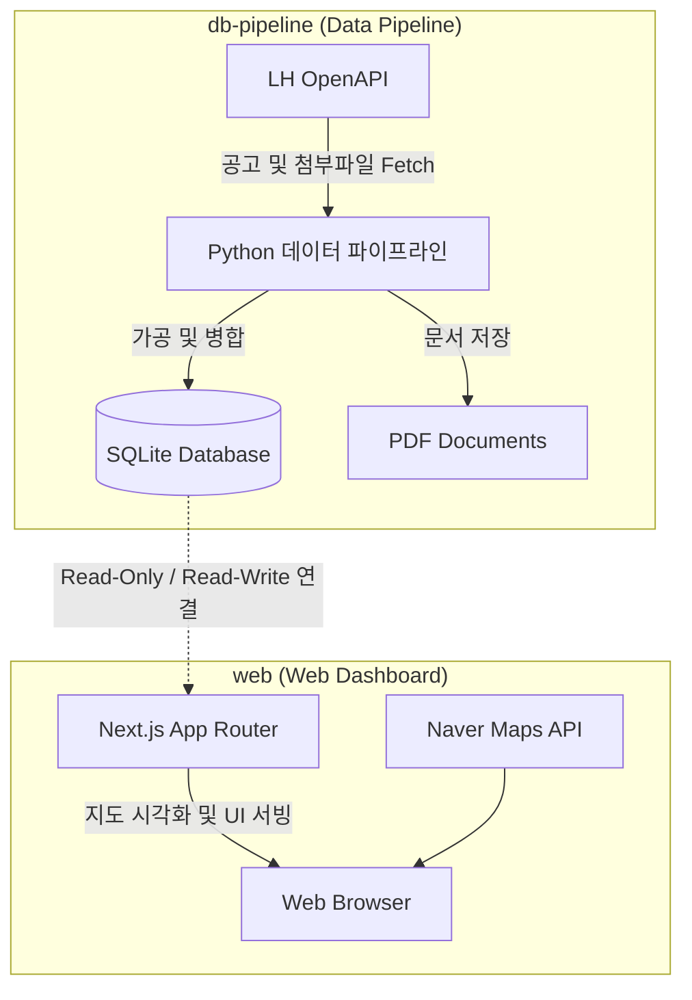
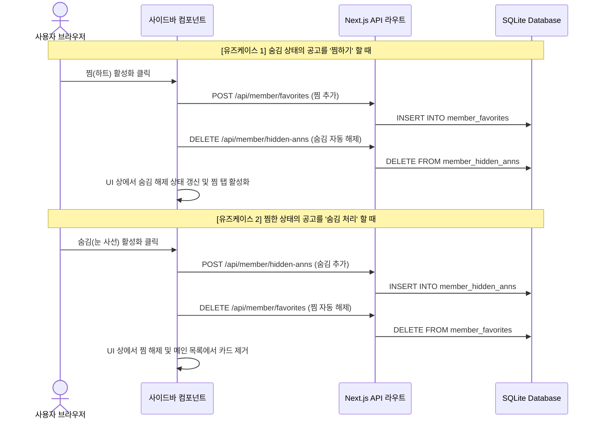

# 서비스 아키텍처 명세서 (Service Architecture Specification)

본 문서는 **PleaseHome (플리즈홈)** 서비스의 전역 시스템 아키텍처, 컴포넌트 간의 상호작용 및 회원 기능(찜하기/숨김)에 따른 비즈니스 로직 설계 정보를 기술합니다.

---

## 1. 아키텍처 설계 철학 (Architecture Philosophy)

초경량 가상 서버(NCP Micro 등, 1GB RAM) 환경에서의 안정적인 서비스 운영을 위해, 무거운 백엔드 연산(API 통신 및 PDF/Excel 대용량 데이터 가공)과 웹서버의 책임 영역을 정밀하게 격리합니다.
* **데이터 적재(db-pipeline)**: 백엔드 파이프라인에서 수집 및 변환 작업을 선제적으로 수행하여 정제 캐싱된 SQLite 공고 DB(`public_housing.db`) 파일 형태로 빌드하여 배포 시 덮어씁니다.
* **웹 서빙 및 회원 관리(web)**: Next.js 서버는 공고 DB(`public_housing.db`)를 Read-Only 조회를 수행하고, 회원 계정/찜/숨김/북마크 등 실시간 변경 데이터는 별도의 회원 전용 DB(`user_data.db`)에 격리 보관하여 배포 시 회원 데이터 유실을 완벽히 차단합니다. UI 컴포넌트는 `Sidebar`의 서브 탭(`SearchTab`, `BookmarkTab`, `MoreTab`, `ComplexTab`) 및 기능별 단위(`AnnouncementCard`, `Map` 등)로 모듈화하여 리렌더링과 유지보수 효율을 극대화합니다. 특히, `DetailPanel` 은 진입 탭 정보(`activeTab`)를 기준으로 조건부 렌더링(공고 탭: 주택형표, 단지 탭: 연관 공고 아코디언)을 처리하여 공고 상세와 단지 상세 구조를 단일 패널로 최적화 연동합니다. 또한 모바일 뷰에서의 사이드바 접기 제어(`activeTab === null`) 시 상태 누락을 방지하고 지도 마커 갱신을 연속성 있게 보존하기 위한 탭 백업 및 폴백 상태 구조(`lastActiveTab`)를 활용해 컴포넌트 간 상호작용 신뢰성을 제어합니다.
* **SSR 하이브리드 렌더링 및 SEO/애드센스 대응**: 메인 루트 페이지(`page.tsx`)를 SSR 서버 컴포넌트로 구동하여 초기 접속 시 구글 봇/검색엔진에게 텍스트 콘텐츠와 정적 HTML `<a>` 링크를 프리렌더링(ISR)해서 전달하고, 대화형 지도 UI는 클라이언트 컴포넌트(`HomeClientLayout.tsx`)로 분리 마운트합니다.

---

## 2. 시스템 아키텍처 및 데이터 흐름 (System Layout)

---

## 3. 회원 연동 및 찜/숨김 데이터 모델 (Member Toggles)

회원의 맞춤형 개인 정보(찜 공고, 숨김 공고)를 SQLite DB 내에서 관계형 테이블로 영속화하여 관리합니다.

### 3.1. 관련 테이블 스키마 정의
* **`member_hidden_anns` (숨김 공고 테이블)**
  - 회원 ID(`member_id`)와 숨긴 공고 ID(`announcement_id`)를 복합 기본키로 구성합니다.
  - 사용자가 관심 없는 공고로 제외시킨 내역을 역순 정렬 타임스탬프(`hidden_at`)와 함께 보관합니다.
* **`member_favorites` (찜한 공고 테이블)**
  - 회원 ID(`member_id`)와 찜한 공고 ID(`announcement_id`)를 복합 기본키로 구성합니다.
  - 사용자가 저장해두고자 하는 공고 내역을 찜한 타임스탬프(`favorited_at`)와 함께 보관합니다.

### 3.2. 상호 베타적 제어 로직 (Exclusive Toggling Architecture)
찜하기(긍정적 관심)와 숨김(부정적 관심) 상태는 논리적으로 공존할 수 없기 때문에 **상호 배제형(Option A) 연동 로직**을 적용했습니다.

---

## 4. API 엔드포인트 규격 (API Reference)

* **숨김 공고 관리**: `/api/member/hidden-anns`
  - `GET`: 회원의 전체 숨김 공고 목록 조회
  - `POST`: 특정 공고 ID를 숨김 상태로 등록
  - `DELETE`: 특정 공고 ID의 숨김 상태를 복원 및 삭제
* **찜한 공고 관리**: `/api/member/favorites`
  - `GET`: 회원의 전체 찜한 공고 목록 조회
  - `POST`: 특정 공고 ID를 찜 목록에 등록
  - `DELETE`: 특정 공고 ID의 찜 상태를 해제 및 삭제
